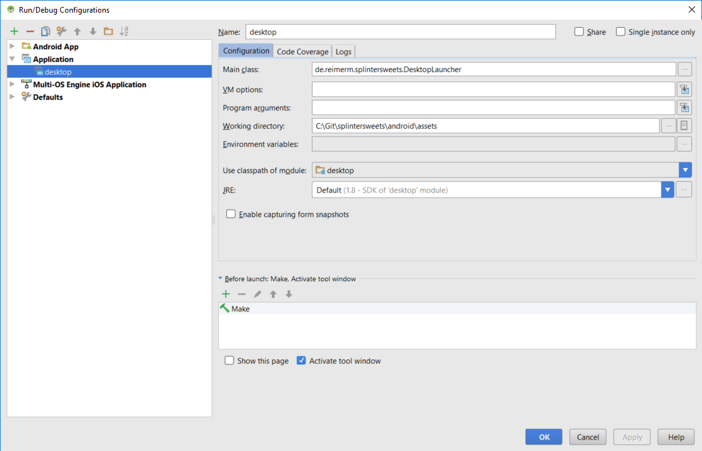

# Splinter Sweets - A LibGDX and Kotlin Mobile Game Example

This is an example of building a mobile game app using the [libGDX](http://libgdx.badlogicgames.com/) game development framework and the Kotlin programming language.

The project includes the following features:
* A simple mobile game to demonstrate the key concepts of the very popular [box2D physics library](https://github.com/libgdx/libgdx/wiki/Box2d).
* The entire project is written in [Kotlin](https://kotlinlang.org/), which is a modern statically typed JVM language and a pretty interesting alternative for Java developers.

## Try it here
  * [Desktop](https://github.com/reime005/splintersweets/raw/master/desktop/splintersweets_v1.jar)
  * [Android](https://play.google.com/store/apps/details?id=de.reimerm.splintersweets)

## Have a look at my Blog
Visit [mariusreimer.com](https://mariusreimer.com/) to follow me and my experience and tutorials on cross-platform mobile game development, kotlin and more.

## Build the Project
  * [Setup your development environment](https://github.com/libgdx/libgdx/wiki)
  * For Android, simply use Android Studio to import the Gradle project. Even for Kotlin it is the best choice, because the IDE has a integrated support.
  * Consider using the Kotlin plugin for Android Studio.
  * To build for desktop, use the following run configuration:
  
  * To build for desktop and create a executable jar file, use the commandline and navigate to your project root folder, then type the following:
    * For **Windows**:
    `gradlew.bat desktop:dist`
    * For **macOS/Linux**:
    `gradlew desktop:dist`
    * You can find the resulting jar in the _desktop/build/libs_ folder.

## License
Copyright © 2018 Marius Reimer

Distributed under the [Apache 2 License](http://www.apache.org/licenses/LICENSE-2.0.html).
